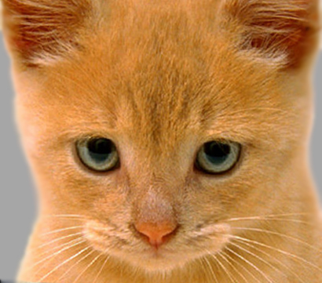
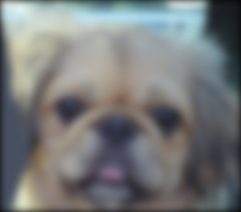

Look at the image from very close, then from far away.

# Homework 1: Image Filtering and Hybrid Images

## Brief
* Due: Sep. 28 
* Required files: `code/*` and your report.

## Overview

The goal of this assignment is to write an image filtering function and use it to create hybrid images using a simplified version of the SIGGRAPH 2006 [paper](http://olivalab.mit.edu/hybrid/OlivaTorralb_Hybrid_Siggraph06.pdf) ([slides](http://olivalab.mit.edu/hybrid/Talk_Hybrid_Siggraph06.pdf)) by Oliva, Torralba, and Schyns.

*Hybrid images* are static images that present different interpretation as the viewing distance changes.
The basic idea is that high-frequency signal (e.g, edges, textures, etc.) tends to dominate perception when closely observing an object. However,  from a distance, only the low-frequency (smooth) part of the signal can be seen. By blending the high-frequency portion of one image with the low-frequency portion of another, you get a hybrid image that leads to different interpretations at different distances.

## Details

This project is intended to familiarize you with Python and image filtering.

* Prerequired packages: 
   1. numpy
   2. opencv
   3. scipy
   4. matplotlib

* Quick Setup (Recommended)
```sh
conda create -n <env_name> python=3.6
conda activate <env_name>
conda install opencv=3.4.2
conda install scipy
conda install matplotlib
```  

**Image Filtering:** Image Filtering(or convolution) is a fundamental image processing tool. See chapter 3.2 of Szeliski and the lecture materials to learn about image filtering (specifically linear filtering). Python has numerous **3rd party** and efficient functions to perform image filtering, but you will be writing your own such function from scratch for this assignment. More specifically, you will implement `my_imfilter()` which imitates the default behavior of the build in `scipy.misc.imfilter` function. As specified in `my_imfilter.py`, your filtering algorithm must 

   1. **support grayscale and color images**
   2. **support arbitrary shaped filters, as long as both dimensions are odd (e.g., 3x5 or 7x9 filters but not 2x2, 4x5 filters)**
   3. **pad the input image with zeros or reflected image content**
   4. **return a filtered image which is the same resolution as the input image.**

We have provided a script, `hw1_test_filtering.py`, to help you debug your image filtering algorithm. 

**Hybrid Images:** A hybrid image is the sum of a low-pass filtered version of the one image and a high-pass filtered version of a second image. There is a free parameter, which can be tuned for each image pair, which controls *how much* high frequency to remove from the first image and how much low frequency to leave in the second image. This is called the "cutoff-frequency". In the paper it is suggested to use two cutoff frequencies (one tuned for each image) and you are free to try that, as well. In the starter code (`hw1.py`), the cutoff frequency is controlled by changing the standard deviation of the Gausian filter used in constructing the hybrid images.

We provide you with 5 pairs of aligned images which can be merged reasonably well into hybrid images. The alignment is important because it affects the perceptual grouping (read the paper for details). We encourage you to create additional examples (e.g. change of expression, morph between different objects, change over time, etc.).

For the example shown at the top of the page, the two original images look like this:




The low-pass (blurred) and high-pass versions of these images look like this:




The high frequency image is actually zero-mean with negative values so it is visualized by adding 0.5. In the resulting visualization, bright values are positive and dark values are negative.

Adding the high and low frequencies together gives you the image at the top of this page. If you're having trouble seeing the multiple interpretations of the image, a useful way to visualize the effect is by progressively downsampling the hybrid image as is done below:


The starter code provides a function `visualize_hybrid_image.py` to save and display such visualizations.

**Forbidden functions**, you can use for testing, but not in your final code: 

- `scipy.misc.imfilter`
- `numpy.convolve`
- `scipy.signal.convolve2d`

**Please write your own python code to perform convolution.**

## Credits
Assignment modified by Min Sun based on James Hays and Derek Hoiem's previous developed projects 


